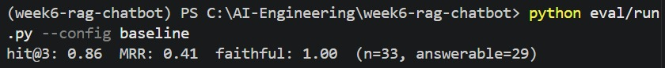
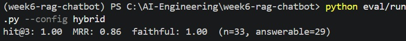

# Method
Golden set size = 33 total  
29 are answerable questions spanning all 10 corpus documents  
4 are refusal cases (marked by "reference": REFUSE)  
Labelling process: for each answerable question, the correct chunk id (filename.md: chunk_index) was found by reading the document's actual chunks, which was done using chunker.py (chunk() function) to print every chunk's text and index.  
Labels are only valid at the chunk size they were recorded under (max_tokens=350).  
## For each of the 33 cases, eval/run.py does 4 things in sequence:  
1. Retrieve  
calls the active config's retriever function: retrieve() for dense, retrieve_hybrid() for hybrid with the question, getting back up to 5 chunks with their Qdrant payloads (source, chunk, text, doc_type).  
2. Generate  
calls answer(), which rebuilds the same numbered source context from those chunks and asks the LLM to answer strictly from it, citing [n] per claim, or refuse verbatim if the sources don't contain the answer.  
3. Score retrieval  
converts the retrieved chunks into "source:chunk" id strings and checks them against the case's labelled "relevant" ids using 2 functions in eval/metrics.py:  
1) hit_at_k(got, relevant, k=3): True  
if any labelled-relevant id appears anywhere in the top-3 retrieved ids, then it will return 1 (True). The closer the final result to 1, the better.  
2) reciprocal_rank(got, relevant): 1/rank of the first labelled-relevant id in the full retrieved list (0 if never appears). This function evaluates the chunk based on its rank position, not just whether it is present.  
4. Score faithfulness  
passes the generated answer and the retrieved-chunk context to judge() in eval/judge.py, a second LLM call at temperature=0 with thinking disabled, prompted to return strict JSON: {"faithful": bool, "unsupported": [string]}. This is an automated-checking for every citation against its source chunk.  
5. refusal_ok compares whether the answer contains the exact refusal string against whether the case is actually labelled as a refusal case ("reference" == "REFUSE") to make sure the bot does not invent ann answer (false confidence) and to check whether the bot gives up on an answerable question (false refusal).  
All 5 results per case are collected into a row; print_scorecard() averages hit@3 and MRR over the answerable rows only (since refusal cases are irrelevant to these metrics), while faithful is averaged over all 33 rows (all cases, since it is also applies to the refusal cases as well).  
# Results
## Baseline (dense only)

## Hybrid (dense + BM25, RRF fusion)
  

# Verdict
Ship hybrid.  
Justification based on the improved results:  
- hit@3 improved from 0.86 to 1.00 (all 4 baseline misses recovered)  
- MRR improved from 0.36 to 0.86 (correct chunks not just present but ranked higher)  
- Faithfulness held steady at 1.00 in both configs, which means the hybrid's retrieval improvement did not come at the cost of the bot inventing unsupported claims.  
