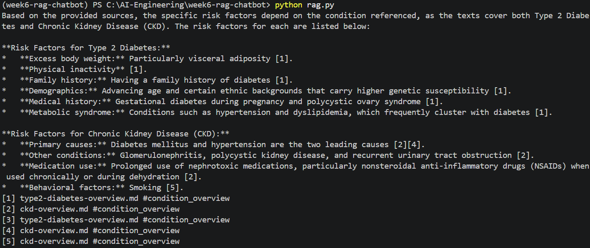

## Chunk-size shootout
**Method:** Re-ran ingestion three times at 150, 350, and 700 tokens per chunk (adjust 'chunk()' params in 'chunker.py', re-run 'ingest.py', 'count()' to confirm the new chunk total each time). Asked the same 5 questions against each index.

| Question | 150-token answer | 350-token answer | 700-token answer |
|---|---|---|---|
| Q1 | 	At what age should adults without additional risk factors begin screening for type 2 diabetes? | Current guidelines generally recommend screening adults beginning at age 35 [1]. |  Current guidelines generally recommend screening adults beginning at age 35, or earlier in those with additional risk factors [1] [2]. | Current guidelines generally recommend screening adults beginning at age 35 [1] [2] [3].
| Q2 | 	What spirometry result confirms a diagnosis of asthma after bronchodilator use? |  A spirometry showing an obstructive pattern with significant bronchodilator reversibility supports the diagnosis [1]. | Spirometry showing an obstructive pattern with significant bronchodilator reversibility, typically defined as an increase in FEV1 of at least 12 percent and 200 mL after bronchodilator administration, supports the diagnosis [1] [2]. | Spirometry showing an obstructive pattern with significant bronchodilator reversibility, typically defined as an increase in FEV1 of at least 12 percent and 200 mL after bronchodilator administration, supports the diagnosis [1] [2] [3].
| Q3 | 	Around how many weeks after knee replacement can most patients resume driving? | Most patients can resume driving once off strong opioid pain medication and with adequate reflexes and strength, usually around four to six weeks [3]. | Most patients can typically resume driving around four to six weeks after surgery, once they are off strong opioid pain medication and have adequate reflexes and strength [3]. | Most patients can resume driving once off strong opioid pain medication and with adequate reflexes and strength, usually around four to six weeks [4].
| Q4 | 	How many headache days per month generally warrants considering preventive migraine treatment? | Preventive therapy should generally be considered for patients experiencing frequent attacks, typically four or more headache days per month [2]. | Preventive therapy should be considered for patients experiencing frequent attacks, typically four or more headache days per month [2] [3]. | Preventive therapy should be considered for patients experiencing frequent attacks, typically four or more headache days per month, or attacks that significantly impair function despite acute treatment [2] [3] [4] [5].
| Q5 | 	During which weeks of pregnancy is the Tdap vaccine recommended? | The Tdap vaccine is recommended during each pregnancy, ideally between 27 and 36 weeks gestation [1] [2]. | The Tdap vaccine is recommended during pregnancy ideally between 27 and 36 weeks gestation [1] [2] [3] [4]. | The Tdap vaccine is recommended ideally between 27 and 36 weeks gestation [1] [2].

The winner: 350 tokens
Whilst all three sizes produced factually correct answers, they have different citation count. 150-token chunks kept citations minimal (1-2) but occasionally under-cited compared to what a fuller answer could support.
Q4's 150-token answer omitted a criterion ("attacks that significantly impair function") that a larger chunk captured. The 700=token chunks captured that same completeness but with higher token cost, citation counts climbed to 3-4 per answer, often citing multiple chunks to support a single simple fact (a sign of top-k slots filling with redundant/overlapping content rather than genuinely new support or noise). Hence, 350 tokens is exactly the right choice since it falls in between, complete answers without noises.

## Refusal test
3 out-of-corpus questions to test whether the bot improvises instead of refusing.

| # | Question | Bot's reply | Exact refusal? |
|---|---|---|---|
| 1 | What is the recommended starting dose of metformin, in mg, for a newly diagnosed type 2 diabetes patient? | I dont have that in the knowledge base. | ✅ |
| 2 | 	What percentage mortality rate is associated with carbapenem-resistant Enterobacteriaceae (CRE) infections compared to susceptible infections? | I dont have that in the knowledge base. | ✅ |
| 3 | What is the recommended follow-up interval, in weeks, for re-administering the PHQ-9 to a patient who has just started an SSRI for moderate depression? | I dont have that in the knowledge base. | ✅ |

## Filter + Citation combo
**doc_type** as stated in ingest.py
Filename	| doc_type
type2-diabetes-overview.md	| condition_overview
asthma-overview.md	| condition_overview
ckd-overview.md	| condition_overview
hypertension-guideline.md	| treatment_guideline
migraine-guideline.md	| treatment_guideline
depression-anxiety-screening-guideline.md	| treatment_guideline
knee-replacement-patient-education.md	| patient_education
cardiovascular-nutrition.md	| patient_education
adult-vaccination-patient-education.md	| patient_education
antibiotic-resistance-summary.md	| clinical_summary

**Document type filtered on:** `doc_type: condition_overview`

**Question asked:** What increases a person's risk of developing this condition?

**Filter implementation:** "Added a `query_filter=models.Filter(must=[models.FieldCondition(key='doc_type', match=models.MatchValue(value='condition_overview'))])` to `client.query_points()` in rag.py."

**Result**
